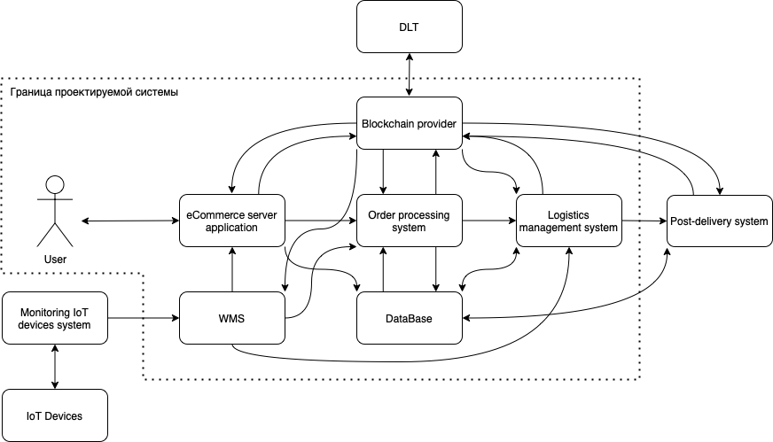
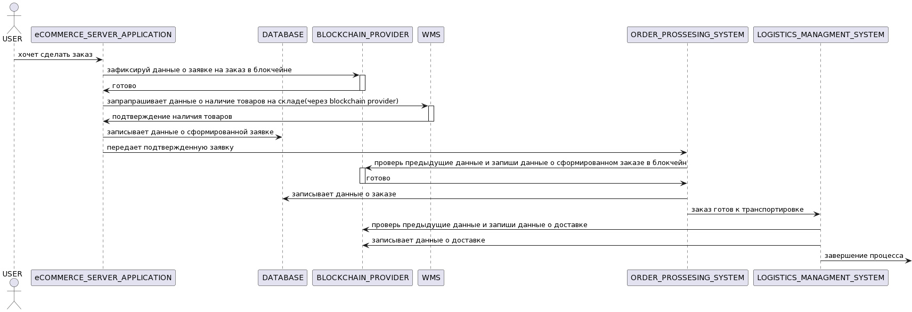

# Система интернет магазина
## Бизнес функция
Система продажи и доставки товаров 
## Концепция безопасности продукта
## Бизнесс процесс

## Роли пользователей
|№  | Роль | Описание | Комментарий |
|----|----|----|----|
|1 | User | делает заказ | должен зарегистрироваться |
|2 | ИТ компания отправителя | доставляет заказ |  |

## Высокоуровневая архитектура
| Название | Назначение | Комментарий |
|----|----|----|
|*eCommerce server application* | Заказ формируется на уровне заявки|  |
|*Order processing system*  | Процессинг заказа(все итерации: оплата, уточнение данных и тд.) | |
|*Logistics managment system* | Логистика доставки заказа(связь с транспортной компанией и тд.) | 
|*SQL Database* | Базы данных компании |
|*Post-delivery system* | Сопровождение заказа после окончания доставки(возврат и др.) | 
|*Blockchain provider*| Передает данные о прохожении этапов доставки в блокчейн сеть|
|*DLT* | блокчейн сеть:  данные хэшируются и остаются в блоках блокчейн сети|  |  
|*IoT devices* | используются для отслеживания и контроля товаров |  |
|*Monitoring IoT devices system* | производит мониторинг всех Iot девайсов, объединяет данные|  |
|WMS| система работы склада| |

## Цели и предположения безопасности
### Цели безопасности
1. Только авторизованные пользователи делают заказ
2. На любом этапе обработки заказа существует возможность отследить момент подмены данных(при наличии)
### Предположения безопасности
1. Не рассматриваются атаки с использованием физического доступа(кража товара во время транспортировки или со склада и др.)
2. Склад считается доверенным компонентом
### Политика архитектуры

### Процесс обработки заказа

[ссылка для редактирования](///www.plantuml.com/plantuml/png/L8r1peCW44RtdeAZ_2DE_4a534DjkY9eNPXeDOhfzGjnKxubx_7cxmX-3-So5tu8wywktGaDymSxMR55F0tJvj-1ZLnBYOQZYxn3uw1j6y712gsIFXwPNe654WWJUlLvgcmql_5_4CgrHdUYkWxsMsOz9ANNpvA7jObw-aU495Jjw4aMPLBNFD3eMf0Ld9m41RL4PN_aENRJlhMKJKx2K1I5vrt56se86s1Wt8hy918D48oEQK75I6GhpzhA0-bZ2-Vko6ClZG-H60OEWBoVUyvtBhUzDVKpmZUCtCFB8t99ZCJ8aEC3LXAP6InWiU9d4NLkU9sajLgZt9O975QyxsGaOomD2oqA5FACtC3hfJbIrdDTm0Pg1gd1Asqy9UYC9I_aKNEWIFKwFTu8bS1Jm6_DsP3A7HiPLTyo9KdA5GFiKz2OFeukZZkg2Ciw_YgMn8HYOZ3vYP26XpaPczVzrbNhygBRCuDX_wxRxWnF8p84Z1kgPDHCowBtidT5QHJwolo7h-RXT5HXU2ScyQ4GF9p0itODfmfw3e_bJfzLcEDGiccGJ4KFmHOobfT0HCPHVn3yrHir16jangLgaYnZuPDctS5rtvccSCTaMGSJWlot6J4S4GsuDoA4FgQbeTEsbiz58zWFv0rMHXBIKa9YQfEV9yglZMUnDkqVMiQrbvY6Tj_iSDY_1RHQGMbSZQxoomEtOwQrqNcdr_vwLtu2)
