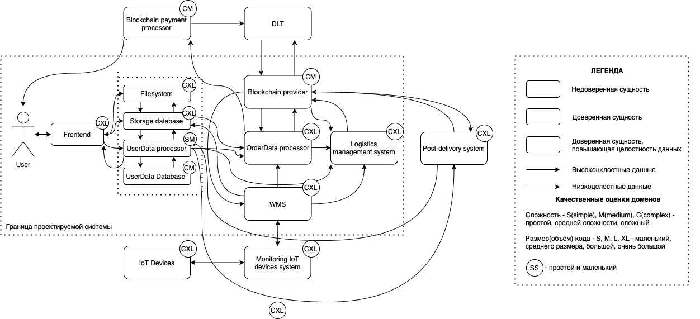
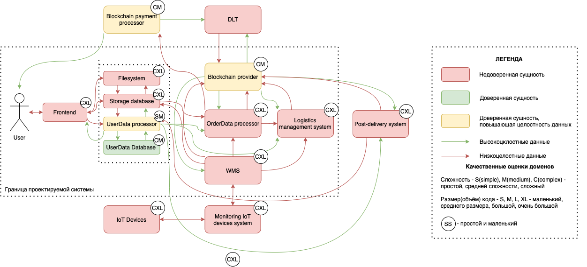

# eCommerce system

## Бизнес функция

Бизнес-функция онлайн магазина заключается в создании удобного и надежного интернет-пространства для продажи товаров и включает в себя такие элементы как:

   1. Обеспечение удобства и простоты использования для клиентов. Необходим интуитивно понятный интерфейс, который позволяет легко найти и выбрать нужные товары, оформить заказ и произвести оплату.
   2. Обеспечение эффективного управления инвентарем товаров. Это включает отслеживание доступности товаров, управление складскими запасами, обновление информации о наличии товаров.
   3. Обеспечение безопасности и конфиденциальности данных клиентов. Применяются соответствующие меры безопасности, чтобы защитить информацию о покупках, платежах и личных данных клиентов.
   4. Разработка системы управления заказами, которая позволяет отслеживать заказы, управлять инвентарем, обрабатывать платежи и организовывать доставку товаров клиентам.

## Ценности и неприемлимые события в их отношении

|№  | Ценность | Неприемлимое событие | Комментарий |
|----|----|----|----|
|1 | Конфиденциальные данные клиента | неавторизованный доступ | оборотный штраф |
|2 | Товар | потеря данных о местонахождении товара | денежные издержки |
|3 | Деньги клиента | потеря в момент оплаты | денежные издержки, ущерб репутации |

## Роли пользователей

|№  | Роль | Описание | Комментарий |
|----|----|----|----|
|1 | User | делает заказ | должен зарегистрироваться |
|2 | ИТ компания отправителя | доставляет заказ |  |

## Высокоуровневая архитектура

| Название | Назначение | Комментарий |
|----|----|----|
|*Frontend* | Заказ формируется на уровне заявки|  |
|*Filesystem* | Заказ формируется на уровне заявки|  |
|*UserData processor*  | Записывает персональные данные в базу, следит за тем, чтобы всем выдавлись только доступные им данные||
|*UserData Database*  | база персональных данных |
|*OrderData processor*  | Процессинг заказа(все итерации: оплата, уточнение данных и тд.) | |
|*Logistics managment system* | Логистика доставки заказа(связь с транспортной компанией и тд.) ||
|*Post-delivery system* | Сопровождение заказа после окончания доставки(возврат и др.) | |
|*Blockchain provider*| Передает данные о прохожении этапов доставки в блокчейн сеть|
|*Blockchain payment processor*| организует процесс оплаты |
|*DLT* | блокчейн сеть:  данные хэшируются и остаются в блоках блокчейн сети|  |  
|*IoT devices* | используются для отслеживания и контроля товаров |  |
|*Monitoring IoT devices system* | производит мониторинг всех Iot девайсов, объединяет данные|  |
|WMS| система работы склада| |

## Цели и предположения безопасности

### Цели безопасности

1. Только авторизованные пользователи делают заказ
2. На всех этапах процессинга и доставки данные о местонахождении товара являются целостными

### Предположения безопасности

1. Не рассматриваются атаки с использованием физического доступа(кража товара во время транспортировки или со склада и др.)
2. Не рассматриваются случае утечки данных от пользователя(расспространение пароля от личного кабинета и тд.)
3. Не рассматриваются атаки на уровне фронтенда, счиатется, что 1 момент взаимодействия с персональными данными пользователя происходит в сущности UserData processor
4. Пректируемая система рассматривается только с точки зрения обеспечения безопасности ценностей 1 и 2. Обеспечение безопасности ценности 3 может считаться отдельной задачей( ) 

### Политика архитектуры

### Процесс обработки заказа

[ссылка для редактирования](///www.plantuml.com/plantuml/png/L8r1peCW44RtdeAZ_2DE_4a534DjkY9eNPXeDOhfzGjnKxubx_7cxmX-3-So5tu8wywktGaDymSxMR55F0tJvj-1ZLnBYOQZYxn3uw1j6y712gsIFXwPNe654WWJUlLvgcmql_5_4CgrHdUYkWxsMsOz9ANNpvA7jObw-aU495Jjw4aMPLBNFD3eMf0Ld9m41RL4PN_aENRJlhMKJKx2K1I5vrt56se86s1Wt8hy918D48oEQK75I6GhpzhA0-bZ2-Vko6ClZG-H60OEWBoVUyvtBhUzDVKpmZUCtCFB8t99ZCJ8aEC3LXAP6InWiU9d4NLkU9sajLgZt9O975QyxsGaOomD2oqA5FACtC3hfJbIrdDTm0Pg1gd1Asqy9UYC9I_aKNEWIFKwFTu8bS1Jm6_DsP3A7HiPLTyo9KdA5GFiKz2OFeukZZkg2Ciw_YgMn8HYOZ3vYP26XpaPczVzrbNhygBRCuDX_wxRxWnF8p84Z1kgPDHCowBtidT5QHJwolo7h-RXT5HXU2ScyQ4GF9p0itODfmfw3e_bJfzLcEDGiccGJ4KFmHOobfT0HCPHVn3yrHir16jangLgaYnZuPDctS5rtvccSCTaMGSJWlot6J4S4GsuDoA4FgQbeTEsbiz58zWFv0rMHXBIKa9YQfEV9yglZMUnDkqVMiQrbvY6Tj_iSDY_1RHQGMbSZQxoomEtOwQrqNcdr_vwLtu2)
