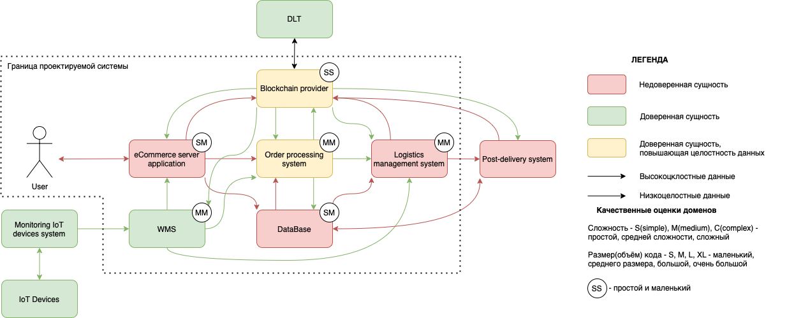

# Система интернет магазина
## Бизнес функция
Система продажи и доставки товаров 
## Концепция безопасности продукта
## Бизнесс процесс

## Роли пользователей
|№  | Роль | Описание | Комментарий |
|----|----|----|----|
|1 | User | делает заказ | должен зарегистрироваться |
|2 | ИТ компания отправителя | доставляет заказ |  |

## Высокоуровневая архитектура
| Название | Назначение | Комментарий |
|----|----|----|
|*eCommerce server application* | Заказ формируется на уровне заявки|  |
|*Order processing system*  | Процессинг заказа(все итерации: оплата, уточнение данных и тд.) | |
|*Logistics managment system* | Логистика доставки заказа(связь с транспортной компанией и тд.) | 
|*SQL Database* | Базы данных компании |
|*Post-delivery system* | Сопровождение заказа после окончания доставки(возврат и др.) | 
|*Blockchain provider*| Передает данные о прохожении этапов доставки в блокчейн сеть|
|*DLT* | блокчейн сеть:  данные хэшируются и остаются в блоках блокчейн сети|  |  
|*IoT devices* | используются для отслеживания и контроля товаров |  |
|*Monitoring IoT devices system* | производит мониторинг всех Iot девайсов, объединяет данные|  |
|WMS| система работы склада| |

## Цели и предположения безопасности
### Цели безопасности
1. Только авторизованные пользователи делают заказ
2. На любом этапе обработки заказа существует возможность отследить момент подмены данных(при наличии)
### Предположения безопасности
1. Не рассматриваются атаки с использованием физического доступа(кража товара во время транспортировки или со склада и др.)
2. Склад считается доверенным компонентом
### Политика архитектуры

