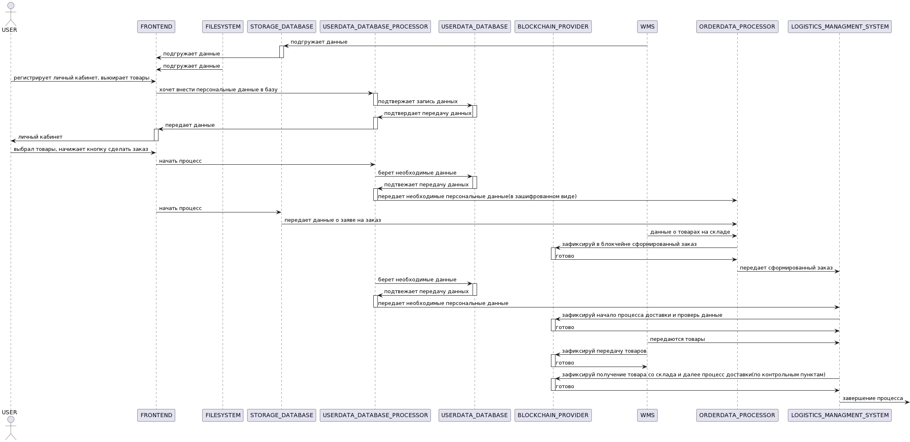

# eCommerce system

## Бизнес функция

Бизнес-функция онлайн магазина заключается в создании удобного и надежного интернет-пространства для продажи товаров и включает в себя такие элементы как:

   1. Обеспечение удобства и простоты использования для клиентов. Необходим интуитивно понятный интерфейс, который позволяет легко найти и выбрать нужные товары, оформить заказ и произвести оплату.
   2. Обеспечение эффективного управления инвентарем товаров. Это включает отслеживание доступности товаров, управление складскими запасами, обновление информации о наличии товаров.
   3. Обеспечение безопасности и конфиденциальности данных клиентов. Применяются соответствующие меры безопасности, чтобы защитить информацию о покупках, платежах и личных данных клиентов.
   4. Разработка системы управления заказами, которая позволяет отслеживать заказы, управлять инвентарем, обрабатывать платежи и организовывать доставку товаров клиентам.

## Ценности и неприемлимые события в их отношении

|№  | Ценность | Неприемлимое событие | Комментарий |
|----|----|----|----|
|1 | Конфиденциальные данные клиента | неавторизованный доступ | оборотный штраф |
|2 | Товар | потеря данных о местонахождении товара | денежные издержки |
|3 | Деньги клиента | потеря в момент оплаты | денежные издержки, ущерб репутации |

## Роли пользователей

|№  | Роль | Описание | Комментарий |
|----|----|----|----|
|1 | User | делает заказ | должен зарегистрироваться |
|2 | ИТ компания отправителя | доставляет заказ |  |

## Высокоуровневая архитектура

| Название | Назначение | Комментарий |
|----|----|----|
|*Frontend* | Заказ формируется на уровне заявки|  |
|*Filesystem* | Заказ формируется на уровне заявки|  |
|*UserData processor*  | Записывает персональные данные в базу, следит за тем, чтобы всем выдавлись только доступные им данные||
|*UserData Database*  | база персональных данных |
|*OrderData processor*  | Процессинг заказа(все итерации: оплата, уточнение данных и тд.) | |
|*Logistics managment system* | Логистика доставки заказа(связь с транспортной компанией и тд.) ||
|*Post-delivery system* | Сопровождение заказа после окончания доставки(возврат и др.) | |
|*Blockchain provider*| Передает данные о прохожении этапов доставки в блокчейн сеть|
|*Blockchain payment processor*| организует процесс оплаты |
|*DLT* | блокчейн сеть:  данные хэшируются и остаются в блоках блокчейн сети|  |  
|*IoT devices* | используются для отслеживания и контроля товаров |  |
|*Monitoring IoT devices system* | производит мониторинг всех Iot девайсов, объединяет данные|  |
|WMS| система работы склада| |

## Цели и предположения безопасности

### Цели безопасности

1. Только авторизованные пользователи делают заказ
2. На всех этапах процессинга и доставки данные о местонахождении товара являются целостными

### Предположения безопасности

1. Не рассматриваются атаки с использованием физического доступа(кража товара во время транспортировки или со склада и др.)
2. Не рассматриваются случае утечки данных от пользователя(расспространение пароля от личного кабинета и тд.)
3. Не рассматриваются атаки на уровне фронтенда, счиатется, что 1 момент взаимодействия с персональными данными пользователя происходит в сущности UserData processor
4. Пректируемая система рассматривается только с точки зрения обеспечения безопасности ценностей 1 и 2. Обеспечение безопасности ценности 3 может считаться отдельной задачей (либо эскалацией нынешней задачи)

### Политика архитектуры

### Процесс обработки заказа

[ссылка для редактирования](//http://www.plantuml.com/plantuml/png/V8z1hi8W54NdNGLB-HJUhyG2XeSQHuIsCMbYRLDetBvY6nCSo91pkFVo5wAVupBS2j_6SIRhEI8OuWDPI36zSD_saxz7yc-qig1uGjSvHw86lA05-OOXWsYreHKuJYqjAK9IGjTaJgfC_2EvWz4C4FMwf6kct_vcPL9PQxPdEofKIZi9ldxhA-eiCTq-XdorDdoho9QC-UDQLmAjOEWaLRIIeAnxDbi5kMt3GF3EL_2OmDK7V0ZwcBQdeYbG5Bd6Kjm4i95ynP6jHfPa-WkxF-eibovDix1rw241WZ3MxEpip59mDE8hE0s8RN4Z4qycTafxShIXDTzpHRzfHGsNbZOux6Z72seCWC33uQ8OWVxoGy5Zc7ygT6hvdXfQKyipBd5kfKJXFVvvzF2jfGwrhzIY7iy-MAfvmS-23kHSecDDAvGl32I0NOAQJD1XJWv4dhFs16X5hON81l0P2dTWwNcfsXAXAB5elA8themm1kQY40Uj3WgwMhZYg6yuxFrGooCwdWl5GTk_AJPA4THH8n_m8rSPpNTrK5aIUEvsC0GfdhCrXYBsqgitjq-iXVFm2lLjdBN3HmxzEuY4cnk8w84fUQa-TEAUWT8RKJqzC0J47bqS__AfpFnS7YV1GHbcqYOGI0wIvc8MkWzPKbABqc1iwgkA7UtgBIXIIy-86BT7LrHxD_W9zZ-05fRgKvm660uwE7SDdy8DFMyK0AhqGlIMdFPz4HyyvN4gU244cgmgnexVkLPYo4x25QdcrdkbTyotUC0C7I1wXxVXwlIWwUJ-qLOC10U03gm3WD47NSWepPeaYpMv8CY5ndYXvREFPNydYuOP_lkc6P1U2YOibcHpibYq4ZA7OuddDTngBRK1fAyeNgRzab6Ie7IxygJucKjqU4dVsdUNTEUcndhv6vJSvKh6U28fzbpvJTtXONF4hgllZlSVFhNgGu-2viJ6pCGhuRSu8Jek1Vetla5gA_JiF7ouFkEepg4ZX3IU3dgp98t_-VZvsoTyg_e3)